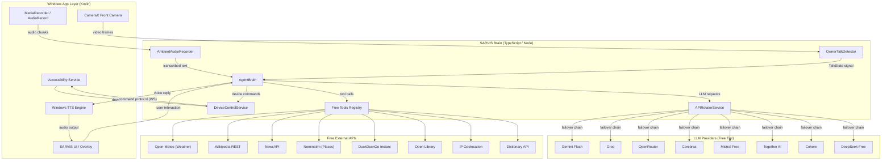
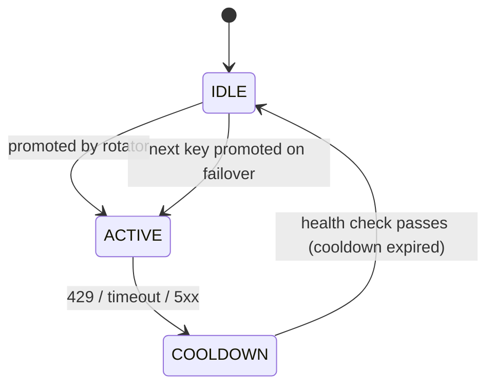
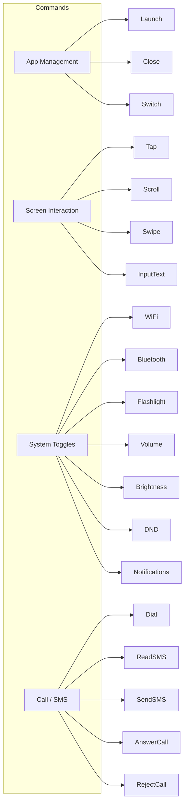
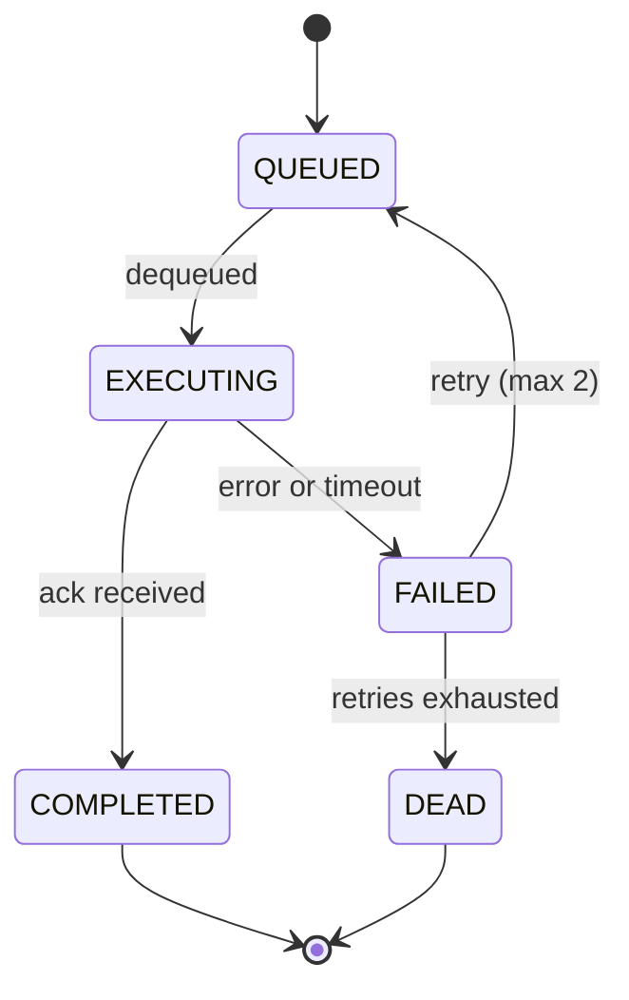
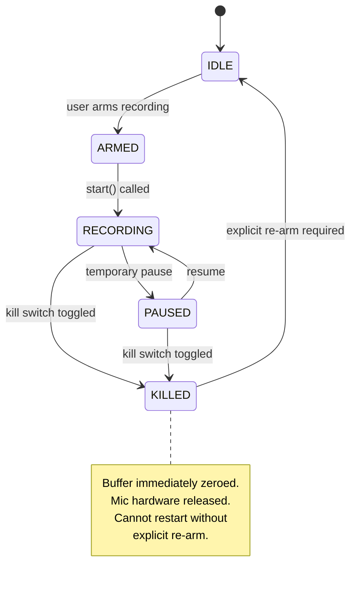
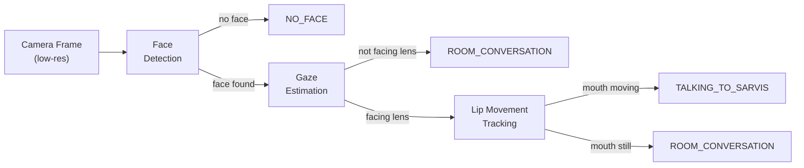
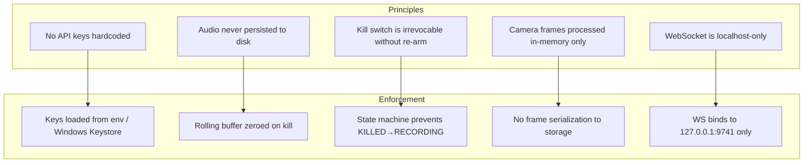

# SARVIS Desktop Assistant — System Architecture

> **Version**: 0.1.0  
> **Generated**: SARVIS Framework Architecture Blueprint  
> **Target Platform**: Windows 10+  
> **Brain Runtime**: Node.js / TypeScript (bridged over localhost WebSocket)

---

## §1 — High-Level System Diagram



---

## §2 — Module Inventory

| ID | Module | Language | File | Layer |
|----|--------|----------|------|-------|
| A | APIRotatorService | TypeScript | `src/services/api_rotator.ts` | Brain |
| B | DeviceControlService | TypeScript | `src/services/device_control.ts` | Brain |
| C | AmbientAudioRecorder | TypeScript | `src/services/audio_recorder.ts` | Brain |
| D | OwnerTalkDetector | TypeScript | `src/services/vision_tracker.ts` | Brain |
| E | AgentBrain | TypeScript | `src/services/agent_brain.ts` | Brain |
| F | Free Tools Registry | TypeScript | `src/tools/free_tools.ts` | Brain |
| G | Type Definitions | TypeScript | `src/services/types.ts` | Brain |
| H | Windows Bridge | Kotlin | `android/` (future) | Native |

---

## §3 — Communication Protocol

### Brain ↔ Windows Bridge

All communication between the TypeScript brain and the Windows native layer uses **JSON messages over a local WebSocket** (`ws://localhost:9741`).

```
┌──────────────────────────────────────────────────────┐
│ Message Envelope                                      │
├──────────────────────────────────────────────────────┤
│ {                                                    │
│   "id": "msg_<nanoid>",                              │
│   "type": "command" | "event" | "ack" | "error",    │
│   "module": "device" | "audio" | "vision" | "brain", │
│   "payload": { ... },                                │
│   "ts": 1723574400000                                │
│ }                                                    │
└──────────────────────────────────────────────────────┘
```

**Command flow:**
1. Brain sends `{ type: "command", module: "device", payload: { action: "launchApp", pkg: "com.example" } }`
2. Windows bridge executes via Accessibility Service
3. Bridge replies `{ type: "ack", id: "<same-id>", payload: { success: true } }`
4. On failure: `{ type: "error", id: "<same-id>", payload: { code: "APP_NOT_FOUND", message: "..." } }`

---

## §4 — Module Deep Dives

### §4.1 — APIRotatorService (Module A) ✅ BUILT

**State Machine:**



**Key design decisions:**
- Max 8 keys, exactly 1 ACTIVE at any time
- Conversation state is **external** to the rotator (stateless HTTP completions)
- Escalating cooldown: `base + (min(failures, 8) × 5s)`
- Background health check reinstates keys after cooldown window

### §4.2 — DeviceControlService (Module B)

**Command taxonomy:**



**Command Queue State Machine:**



**Concurrency model:** Serial command queue (one command executes at a time via the Accessibility Service). Commands timeout after 10s if no ack is received.

### §4.3 — AmbientAudioRecorder (Module C)

**Rolling Buffer Architecture:**

```
Time →  [Chunk 0][Chunk 1][Chunk 2][Chunk 3][Chunk 4] ...
         ←─────── 30s rolling window ─────────→
         oldest                              newest
         (overwritten)                        (recording)
```

Each chunk = 5 seconds of PCM audio. Buffer holds 6 chunks = 30s total. When chunk 7 arrives, chunk 0 is discarded.

**Kill Switch State Machine:**



**Security guarantees:**
1. Kill switch is a **hard stop** — zeroes all buffer memory, releases mic hardware
2. Cannot transition from `KILLED` → `RECORDING` without explicit `arm()` call
3. Kill switch activation emits a `kill_switch_activated` event to all listeners
4. No audio data persists to disk — buffer is memory-only

### §4.4 — OwnerTalkDetector (Module D)

**Detection Pipeline:**



**Lip Movement Detection Algorithm:**
1. Extract mouth landmarks (MediaPipe FaceMesh points 13, 14 for inner lips)
2. Compute Mouth Aspect Ratio (MAR): `MAR = vertical_dist / horizontal_dist`
3. Track MAR deltas over a rolling window of 10 frames
4. If `stddev(MAR_deltas) > threshold` → mouth is moving
5. Combined with gaze angle `< 30°` from lens axis → `TALKING_TO_SARVIS`

**Thresholds (configurable):**
| Parameter | Default | Description |
|-----------|---------|-------------|
| `mouthOpenRatio` | 0.3 | MAR threshold for "open" |
| `gazeAngleTolerance` | 30° | Max yaw from camera axis |
| `movementDeltaThreshold` | 0.05 | Min stddev for "talking" |
| `frameSlidingWindow` | 10 | Frames for smoothing |

---

## §5 — Data Schemas

All shared types are defined in `src/services/types.ts`. Key schemas:

- **KeyConfig** — API key configuration (provider, endpoint, limits)
- **Conversation** — Persisted transcript for context continuity across failovers
- **Reminder** — Voice-extracted tasks with due times
- **BehaviorProfile** — Owner habits, routines, tone preferences
- **TalkState** — Vision classifier output enum
- **ToolResult** — Standardized free tool response format
- **ScreenTimeEntry** — App usage tracking for nudge system

---

## §6 — Security Model



---

## §7 — Free Tool API Coverage

| Tool | API | Key Required | Rate Limit | Status |
|------|-----|:---:|------------|--------|
| Weather | Open-Meteo | ❌ | Unlimited | ✅ Built |
| Wikipedia | REST v1 | ❌ | Reasonable use | ✅ Built |
| News | NewsAPI.org | ✅ (free) | 100/day | ✅ Built |
| Places | Nominatim | ❌ | 1 req/s | ✅ Built |
| Web Search | DuckDuckGo Instant | ❌ | Reasonable use | 🔨 Building |
| Books | Open Library | ❌ | Unlimited | 🔨 Building |
| Geolocation | ip-api.com | ❌ | 45/min | 🔨 Building |
| Dictionary | Free Dictionary | ❌ | Unlimited | 🔨 Building |
| Quotes | quotable.io | ❌ | Unlimited | 🔨 Building |

---

## §8 — Build & Test Strategy

```bash
# Type check
npm run build

# Run all tests
npm test

# Run specific test suite
npm run test:rotator
npm run test:device
npm run test:audio
npm run test:vision
```

All tests use Node.js built-in `node:test` runner — zero external test dependencies.
